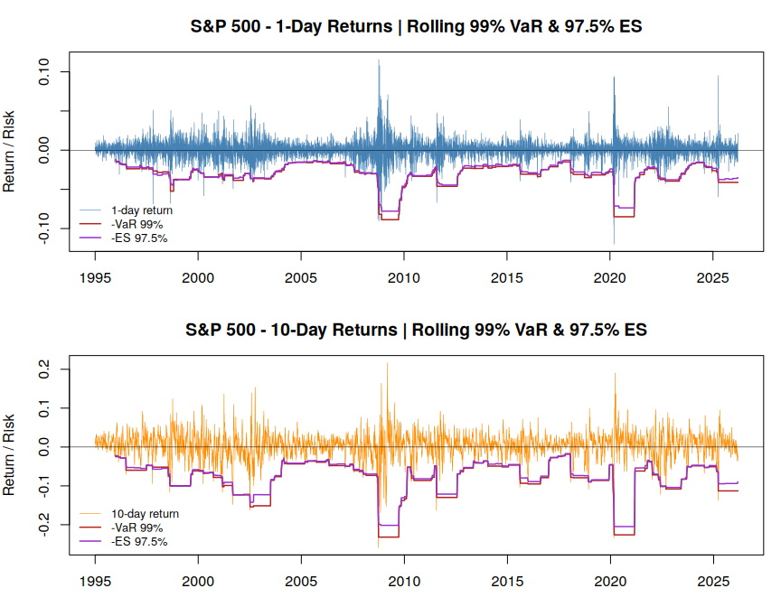
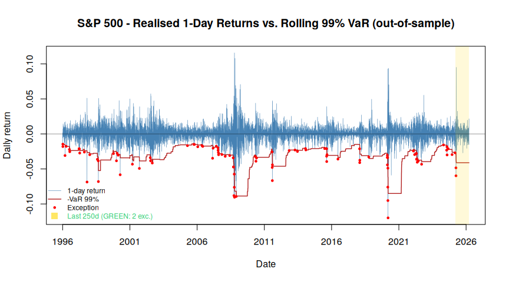

# S&P 500 — Market Risk Analysis

**Out-of-sample validation of a 99% Historical Value-at-Risk model on 30+ years of S&P 500 returns.**
Historical VaR · Expected Shortfall (97.5%) · a simplified FRTB IMA-style capital charge · Basel traffic-light backtesting with formal Kupiec & Christoffersen coverage tests.

---

[S&P-500 project](SP500_analysis.md)

## Overview

A self-contained market-risk study, written in **base R**, that takes daily S&P 500 prices from raw data all the way through to regulatory-style risk metrics. Rather than stopping at "here is the VaR number," the project is built around the question a risk or model-validation function actually has to answer before a model can be relied on for capital:

> **Does a standard 99% Value-at-Risk model genuinely hold up out-of-sample — and would it survive a regulatory backtest?**

The full pipeline runs from raw prices to a defensible answer:

1. Data loading and cleaning
2. Daily and 10-day return construction
3. Rolling **Historical VaR (99%)**
4. Rolling **Expected Shortfall (97.5%)** — the FRTB level
5. **VaR vs. ES** comparison and a `√10` scaling cross-check
6. A **simplified FRTB Internal Models Approach (IMA)-style** capital charge
7. **Basel traffic-light backtesting** plus formal **Kupiec** and **Christoffersen** coverage tests on the *realised* index returns

Two principles run through the whole analysis. First, **every result on the real index is deterministic and fully reproducible** — the only stochastic component is an isolated synthetic sanity-check, fenced off in an appendix and explicitly *not* a result about the S&P 500. Second, **the model is reported honestly, including where it fails** — which, on this sample, it does. Surfacing that failure and explaining *why* it happens is treated as the point of the exercise, not something to paper over.

*Realised returns against the rolling 99% VaR and 97.5% ES, 1-day (top) and 10-day (bottom) horizons.*

---

## Data

- **Source:** daily S&P 500 OHLC prices (`spx_d.csv`) from [Stooq](https://stooq.pl/q/d/l/?s=%5Espx&i=d).
- **Window:** 1995-01-03 → 2026-03-23 — **7,857 daily observations**.
- **Fields used:** `Date`, `Open`, `Close` only.

---

## Methodology

**1 · Returns.** Simple (arithmetic) returns at two horizons: 1-day, and overlapping 10-day (the Basel regulatory horizon). Each 10-day return shares nine days with its neighbour, so the series is serially correlated *by construction* — a fact flagged up front, because it later determines which tests can legitimately be run on it.

**2 · Historical VaR (99%).** A rolling 252-day (one trading year) Historical VaR using the `(n+1)·p` plotting-position quantile. The estimator is **strictly out-of-sample**: VaR on day *t* is computed only from returns in `[t-252, t-1]` and never sees day *t* itself. The same alignment is reused everywhere downstream, including the backtest, so there is no separate look-ahead correction to get wrong.

**3 · Expected Shortfall (97.5%).** The average loss *given that we are in the worst 2.5% of days* — the coherent, tail-sensitive measure the FRTB adopts in place of VaR — computed as a rolling tail average over the same 252-day window. VaR and ES deliberately use different conventions (a quantile position vs. a tail mass), which is documented rather than glossed over.

**4 · VaR vs. ES + `√10` cross-check.** A side-by-side comparison of the two measures, plus the regulatory `√10` shortcut (scaling 1-day VaR to a 10-day horizon under an i.i.d. assumption) checked against the directly-measured 10-day VaR. The two disagree — which is *expected*, since real returns are neither i.i.d. nor serially independent — and the comparison is presented as a sanity check, not a claim that either figure is "correct."

**5 · Simplified IMA-style charge.** Captures the *spirit* of the FRTB Internal Models Approach: capital driven by the larger of a **stressed-period ES** and a **current ES (97.5%)**, with the stress window found by scanning every 252-day window for the highest ES. It is explicitly a **simplification** — it omits the regulatory multiplier (`m_c ≥ 1.5`), liquidity-horizon scaling, the non-modellable-risk-factor (NMRF/SES) add-on, the default-risk charge (DRC), and cross-risk-class aggregation — and is labelled as such rather than presented as a real capital number.

**6 · Basel backtesting — the centrepiece.** Realised 1-day returns are compared against the out-of-sample VaR; exceptions are counted and assessed against the **Basel traffic light** over the most recent 250 trading days (the regulatory one-year window), then subjected to **formal coverage tests**: Kupiec's unconditional-coverage (POF) test, Christoffersen's independence test, and the combined conditional-coverage test. The chi-square tests are run on the long 1-day sample (~7,600 observations), where the asymptotics are reliable — and deliberately *not* on the overlapping 10-day series, whose serial dependence would violate the independence assumption.

**Appendix · classifier sanity-check (synthetic — not an S&P result).** A seeded, regime-switching synthetic series, used purely to confirm that the breach-counting and traffic-light logic behave correctly on data with a known, deliberately stressed regime. It is clearly fenced off and is *not* a risk statement about the index.

---

## Key results

*Reported in context, not as headline figures.*

| Measure | 1-day | 10-day (overlapping) |
|---|---:|---:|
| Historical VaR 99% — mean | 3.22% | 8.40% |
| Historical VaR 99% — peak | 8.86% | 23.19% |
| Expected Shortfall 97.5% — mean | 3.02% | 7.82% |
| Simplified IMA-style charge | 7.79% | 20.47% |

The VaR peak falls in the 2007–08 stress window; the 97.5% ES runs at roughly **0.95×** the 99% VaR on average (consistent with the two levels being chosen to be broadly comparable). In both horizons the IMA-style charge is **bound by the stressed period**, not the recent one — the 1-day stress window lands on the global financial crisis (Dec 2007 – Dec 2008) and the 10-day window on the COVID crash (to Mar 2020).

**The validation verdict.** Over the full history the 99% VaR is **breached on 1.28% of days (97 / 7,604), against an expected 1.00%**, and — more importantly — the breaches **cluster in time**. The formal tests reflect both problems:

| Test | *p*-value | Decision |
|---|---:|:---|
| Kupiec POF (unconditional coverage) | 0.021 | reject |
| Christoffersen (independence) | < 0.001 | reject |
| Conditional coverage | < 0.001 | reject |

The model is therefore **rejected on all three tests**. This is the textbook failure mode of equal-weighted historical simulation: it reacts slowly to changes in volatility and does not model volatility clustering, so breaches bunch together in crises. It is a known limitation of the *method*, not a coding artefact — and a conditional model (EWMA- or GARCH-filtered historical simulation) would be the natural next step to target both effects.

At the same time, over the **most recent 250 trading days the model sits comfortably in the Basel GREEN zone (2 exceptions)** — a reminder that a one-year regulatory window can look healthy even for a model that is rejected over the long run. Holding both facts together, rather than reporting only the flattering one, is the intended takeaway.

*The primary backtest: out-of-sample 99% VaR against realised returns, exceptions in red, the last regulatory year shaded.*

---

## What this project demonstrates

- End-to-end **market-risk measurement in R**, from raw data to regulatory-style metrics.
- A **model-validation mindset** — framing the task as "does the model hold up?", running the formal tests, and reporting the model *failing*, honestly and with the cause explained.
- Working familiarity with the **regulatory vocabulary** — FRTB Expected Shortfall at 97.5%, the Internal Models Approach, the Basel traffic light, the `√10` rule — and the discipline to label simplifications as simplifications.
- Care with **statistical validity** — out-of-sample alignment, the overlapping-returns pitfall, and choosing where each test can legitimately be applied.

---

## Known limitations

- **Equal-weighted historical-simulation VaR** reacts slowly to volatility changes (ghosting; no volatility scaling) and does not model volatility clustering, so it under-reacts to regime shifts — visible here in both the above-1% exception rate and the rejected independence test.
- The **10-day figures use overlapping returns** and are therefore serially correlated; their exception counts are descriptive only and are *not* comparable to 1% (hence the formal coverage tests run on the 1-day series).
- The **IMA-style charge is a simplification** (no regulatory multiplier, liquidity horizons, NMRF/SES add-on, DRC, or cross-class aggregation).
- **ES is reported via exceedance counts** — a monitoring diagnostic, not a formal ES backtest. ES is not elicitable, so there is no clean expected frequency to test against; a proper backtest would use the Acerbi–Székely (2014) tests.

---

## Reproducibility

- **Base R only** — no external packages for the analysis itself; `knitr` is used purely to render the tables.
- All real-index results are **deterministic**.
- The synthetic appendix is seeded with `set.seed(42)`; its output is RNG-dependent and is a sanity-check, not a result.
- Built and rendered under **R 4.3.3**.

---

## References

- Basel Committee on Banking Supervision — supervisory framework for backtesting (traffic-light approach) and the FRTB minimum capital requirements for market risk.
- Kupiec, P. (1995). *Techniques for Verifying the Accuracy of Risk Measurement Models.* Journal of Derivatives.
- Christoffersen, P. (1998). *Evaluating Interval Forecasts.* International Economic Review.
- Acerbi, C., & Székely, B. (2014). *Backtesting Expected Shortfall.* Risk.
